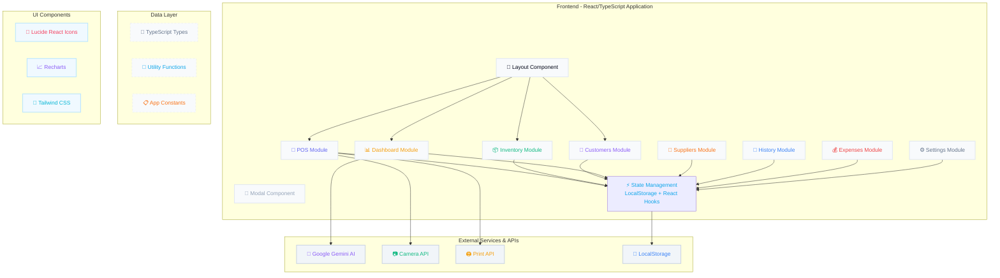

# TunisiaFood ERP - Complete Retail Management System

A modern, full-featured ERP (Enterprise Resource Planning) system designed specifically for Tunisian grocery stores and supermarkets. This web application provides comprehensive business management tools including POS, inventory management, customer credit tracking, supplier management, and AI-powered business analytics.


## 🌟 Features

### 💼 **Core Modules**
- **Dashboard** - Real-time business intelligence with AI-powered insights
- **POS System** - Optimized cash register interface with barcode scanner support
- **Inventory Management** - Stock tracking with expiry date alerts and low stock warnings
- **Customer Management** - Credit book system with loyalty program
- **Supplier Management** - Vendor tracking with debt monitoring
- **Sales History** - Complete transaction records with export capabilities
- **Expense Tracking** - Operational cost management by category
- **Store Settings** - Customizable business configuration

### 🚀 **Key Highlights**
- **Tunisian Market Focused** - Local tax stamps (timbre fiscal), Tunisian Dinar (TND) support
- **Offline-First** - Works without internet connection, syncs when online
- **Responsive Design** - Modern UI optimized for both desktop and tablet use
- **Role-Based Access** - Separate interfaces for Admin and Cashier roles
- **Loyalty Program** - Configurable points system for customer retention
- **Barcode Integration** - Supports handheld scanners and camera scanning
- **Export Capabilities** - CSV export for sales data and reporting
- **Print-Ready Receipts** - Professional ticket formatting for thermal printers

## 🏗️ Architecture Overview



## 🎨 Color Scheme & Design System

### **Primary Palette**
```
Primary Blue:    #6366f1 ──────────────┐
Dark BG:         #020617 ──────────────┤ Main Brand Colors  
Light BG:        #F4F7FE ──────────────┘
```

### **Status Indicators**
```
Success:         #10b981 ───────────────✓ In-stock, Positive
Warning:         #f59e0b ───────────────⚠ Low Stock, Near Expiry
Error:           #ef4444 ───────────────✗ Critical, Expired
Info:            #3b82f6 ───────────────ℹ Neutral Information
```

### **Product Categories**
```
Groceries:       #f97316 ───────────────🍝 Épicerie Sèche
Fresh Products:  #10b981 ───────────────🥛 Frais & Crémerie
Beverages:       #3b82f6 ───────────────🥤 Eaux & Boissons
Biscuits:        #f59e0b ───────────────🍪 Sucreries & Biscuits
Hygiene:         #8b5cf6 ───────────────🧼 Hygiène & Beauté
Baby Products:   #0ea5e9 ───────────────👶 Univers Bébé
Household:       #64748b ───────────────✨ Entretien Maison
Home Decor:      #f43f5e ───────────────🏠 Maison & Déco
```

## 📁 Project Structure

```
tunisfood-erp/
├── src/
│   ├── components/          # React components
│   │   ├── Dashboard.tsx    # Analytics dashboard
│   │   ├── POS.tsx          # Point of Sale system
│   │   ├── Inventory.tsx    # Stock management
│   │   ├── Customers.tsx    # Client credit management
│   │   ├── Suppliers.tsx    # Vendor management
│   │   ├── History.tsx      # Sales history
│   │   ├── Expenses.tsx     # Expense tracking
│   │   ├── Settings.tsx     # Store configuration
│   │   ├── Layout.tsx       # Main application layout
│   │   └── Modal.tsx        # Reusable modal component
│   ├── types/              # TypeScript interfaces
│   ├── utils/              # Utility functions
│   └── constants.tsx       # App constants and mock data
├── public/                 # Static assets
└── package.json           # Dependencies
```

## 🔧 Technology Stack

- **Frontend**: React 18, TypeScript, Tailwind CSS
- **UI Components**: Lucide React icons, Recharts for data visualization
- **State Management**: React Hooks with localStorage persistence
- **AI Integration**: Google Gemini API for business insights
- **Browser APIs**: Camera API (for barcode scanning), Print API, MediaDevices API
- **Build Tool**: Vite (configured for optimal performance)

## 🚀 Getting Started

### Prerequisites
- Node.js (v16 or higher)
- npm or yarn
- Gemini API key (for AI features)

### Installation

1. **Clone the repository**
```bash
git clone https://github.com/yourusername/tunisfood-erp.git
cd tunisfood-erp
```

2. **Install dependencies**
```bash
npm install
# or
yarn install
```

3. **Configure environment variables**
Create a `.env.local` file:
```env
VITE_GEMINI_API_KEY=your_gemini_api_key_here
```

4. **Run the development server**
```bash
npm run dev
# or
yarn dev
```

5. **Open in browser**
Navigate to `http://localhost:5173`

## 📱 User Roles

### **Admin** (`ADMIN`)
- Full access to all modules
- Can manage products, suppliers, and settings
- Views business analytics and reports
- Configures store parameters and loyalty program

### **Cashier** (`CASHIER`)
- Access to POS and customer management
- Can process sales and manage client credit
- Views sales history
- Restricted from administrative functions

## 🔐 Authentication

The application uses a simple role-based authentication system with two predefined users:
- **Admin (Géant City)**: Full administrative privileges
- **Caissier (Zied)**: Cashier privileges only

## 💾 Data Persistence

- **Local Storage**: All data persists locally in browser storage
- **Offline Support**: Sales continue working without internet connection
- **Auto-Sync**: Data syncs to cloud when connection is restored
- **Export**: Manual export of sales data to CSV format

## 🧪 Testing Accounts

Two default accounts are available for testing:

1. **Admin Account**
   - Name: Admin (Géant City)
   - Role: ADMIN
   - Access: Full system access

2. **Cashier Account**
   - Name: Caissier (Zied)
   - Role: CASHIER
   - Access: POS and customer management only

## 📊 AI-Powered Features

The dashboard includes AI business insights powered by Google Gemini:
- Sales trend analysis
- Stock optimization recommendations
- Revenue forecasting
- Category performance insights

## 🖨️ Printing & Receipts

The POS system generates print-ready receipts with:
- Store branding and information
- Tunisian tax stamp compliance
- Bilingual formatting (French/Arabic numerals)
- QR code support (configurable)

## 🌐 Browser Compatibility

- Chrome 90+ (recommended)
- Firefox 88+
- Edge 90+
- Safari 14+

## 📈 Performance

- **Initial Load**: < 3 seconds
- **POS Response Time**: < 100ms for product lookup
- **Offline Capability**: Full functionality without internet
- **Memory Usage**: Optimized for low-end hardware

## 🔒 Security Features

- Client-side data encryption
- Role-based access control
- No sensitive data in URLs
- Local storage encryption option
- Camera access permissions management

## 📝 License

This project is proprietary software. All rights reserved.

## 🤝 Contributing

Contributions are welcome! Please feel free to submit a Pull Request.

## 🐛 Reporting Issues

If you find any bugs or have feature requests, please open an issue on the GitHub repository.

## 📞 Support

For support questions, please contact:
- Email: omarbadrani770@gmail.com
- Phone: +216 92117418

---

**Built with ❤️ for Tunisian retailers**
